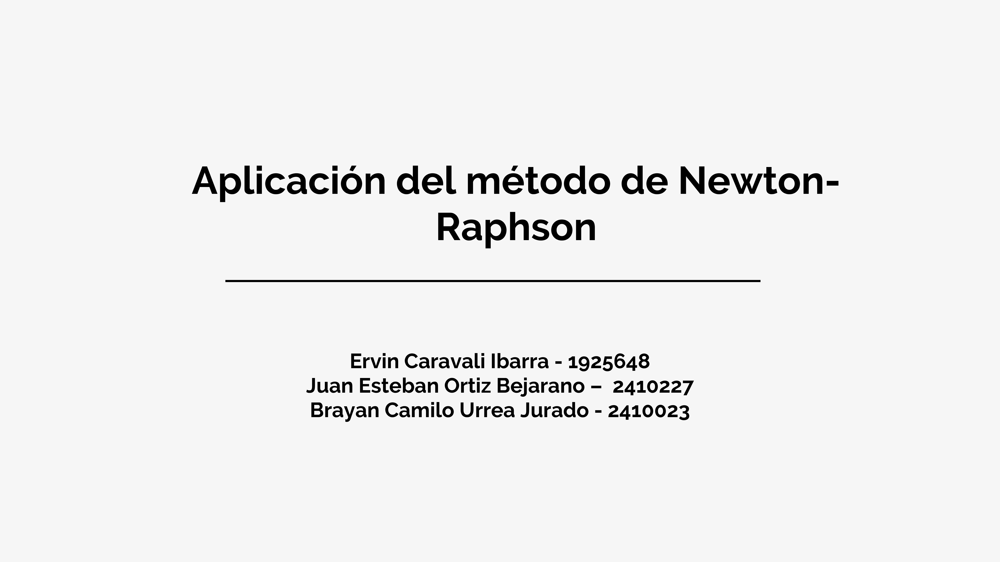
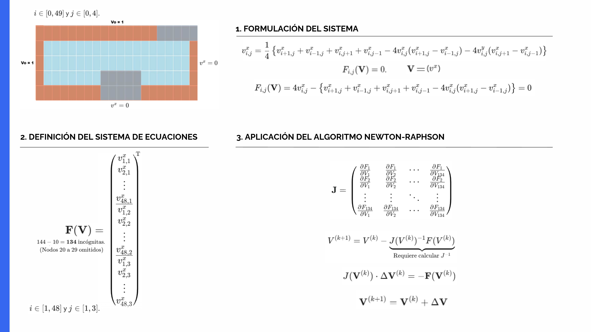
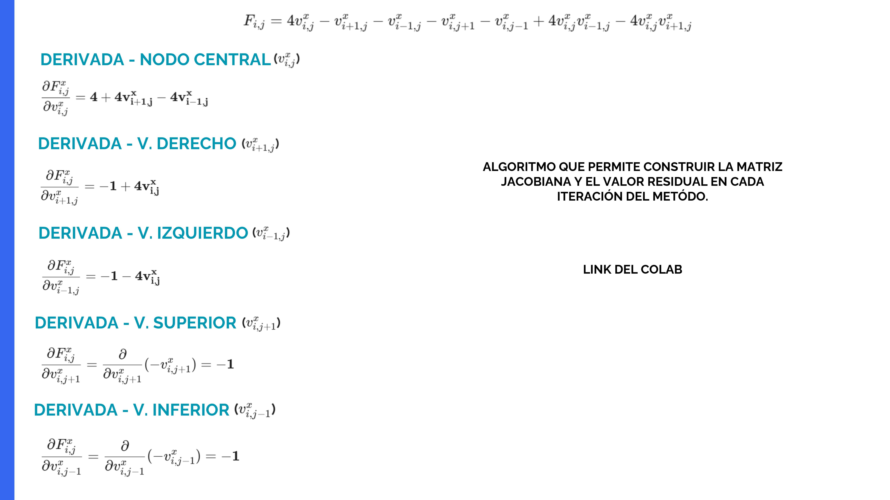

## Aplicación del Método de Newton–Raphson en la solución del sistema de ecuaciones no lineales

- Fuente principal: `Introducción al sistema.pdf` (imágenes extraídas) y `AVANCE 2.md`/`AVANCE 2.docx` (formulación y código).

### 1. Planteamiento del problema
- Se resuelve un sistema no lineal sobre una malla 5×50 con condiciones de frontera y una viga (nodos omitidos), resultando en 134 incógnitas de velocidad.
- El problema se formula como residual F(V)=0, adecuado para Newton–Raphson.

### 2. Formulación del residual y sistema
- Residual F(V) en cada nodo interior (i,j): combina términos difusivos y convectivos.
- Vector de incógnitas V incluye solo nodos no fijos; se excluyen fronteras y la viga.

Puntos clave:
- Total 144 nodos menos 10 omitidos → 134 incógnitas.
- Definición de T(V), A y ecuación lineal local en cada iteración: T(V^k) − A ΔV^k = −F(V^k).

### 3. Jacobiano del sistema
- Se construye por derivadas parciales respecto al nodo central y sus 4 vecinos (derecha, izquierda, arriba, abajo), coherente con F(V).

- Estructura dispersa 134×134, ensamblada con mapeo de índices que omite fronteras y la viga.

### 4. Algoritmo de Newton–Raphson
- Iteraciones k = 0,1,… hasta convergencia:
  1) Ensamblar J(V^k) y F(V^k)
  2) Resolver J ΔV = −F (solver disperso)
  3) Actualizar V^{k+1} = V^k + ΔV
  4) Criterios de paro: norma de F y/o de ΔV

### 5. Implementación (resumen)
- Lenguaje: Python, `numpy` + `scipy.sparse` (`lil_matrix`, `spsolve`).
- Mapeo `map_to_index(i,j)` salta fronteras y la viga (10 nodos), garantizando índices [0..133].
- Residual F y Jacobiano J armados por doble bucle en (i,j):
  - J[m,m] = 4 + c*(V_{i-1,j}) − c*(V_{i+1,j})
  - Vecinos: contribuciones −1 o ±c*V_{i,j} según dirección.
- Ciclo NR con `MAX_ITER` y `TOL`, registro de normas de F y ΔV.

### 6. Resultados esperados
- Convergencia típica en pocas decenas de iteraciones si la inicialización es razonable.
- V campo solucionado sobre las 134 incógnitas; opcional: reshape a malla e inspección/plots (no incluidos en PDF).

### 7. Observaciones y recomendaciones
- Validar J con diferencias finitas en algunos nodos.
- Considerar damping (λ∈(0,1]) si hay problemas de convergencia.
- Documentar tolerancias y condiciones de borde exactas usadas.

### 8. Referencias a archivos
- Documento visual: `Introducción al sistema.pdf` (imágenes extraídas arriba).
- Descripción y código: `AVANCE 2.md` y `AVANCE 2.docx`.
